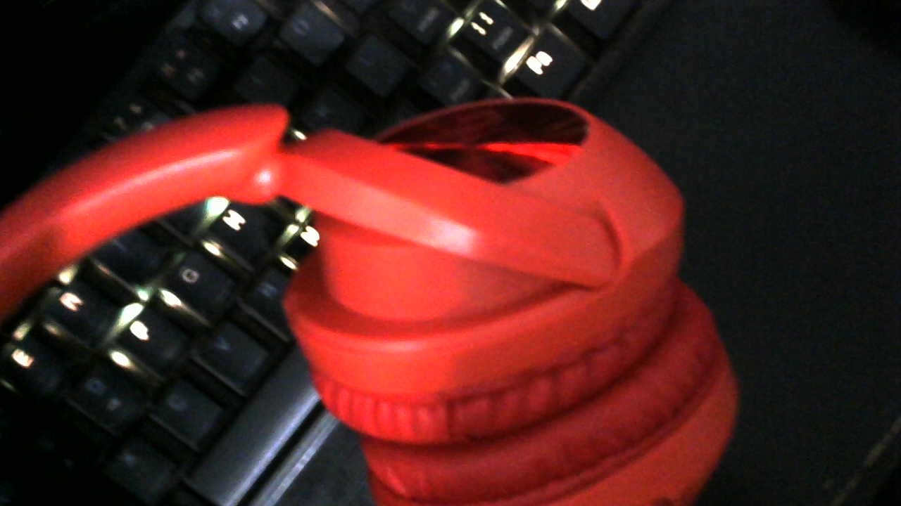

## Project of LIFE

Understand, there is nothing you cannot do alone. John Grillo Wick.

It's easy to observe in admiration what they are never, I observe society from all sources and see its weak points,
there is no success, there is no evolution without error, the Asian tigers love that society, there is no other place I can't be, 
certainly like jumping and being in war, look at the high wall, we play basketball, fuck it. 

I'm just a programmer, nothing more and maybe someone with insight beyond the others, man the Americans and/or their affiliates don't understand,
whether it's Nikes or Seila or whatever, I'm not friends with anyone but a mobster, what's in my head to create a system to sell millions of shirts, 
and force the crowd to use VIBEgoods, damn it's going to be awesome, after teams, then I pay and inject everything,
everyone using them, then the Chinese headphones after everything

